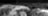
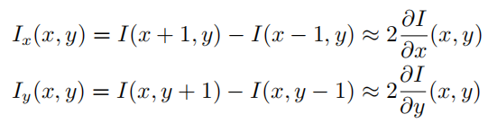
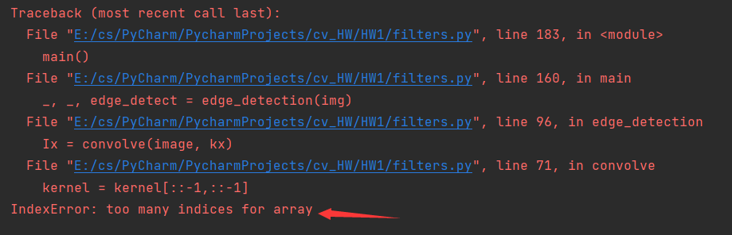

# cv_HW 

## cv_HW1

* [整体分析](#整体分析)
* [Task 1](#Task 1: Image Patches)
* [Task 2-1](#Task 2-1: Convolution and Gaussian Filter)
* [Task 2-2](Task 2-2: Edge detection)
* [Task 3](#Task 3)
* [心得体会](#心得体会)

### 整体分析

代码中包含main函数和另外6个函数：

* read_img ： 读取图片，已完成
* save_img ： 保存图片，已完成
* image_patches ： Q1相关代码需要补充
* convolve ： 
* edge_detection
* sobel_operator

### Task 1: Image Patches

#### 问题描述

A patch is a small piece of an image. Sometimes we will focus on the patches of an image instead of operating on the entire image itself.

**Task 1:** Complete the function image patches in filters.py. This should divide a grayscale image into a set of non-overlapping 16 *×* 16 pixel image patches. Normalize each patch to have zero mean and unit variance.Plot and put in your report three 16 *×* 16 image patches from grace hopper.png loaded in grayscale.

#### 实验过程

##### 1. 将图片分成没有重叠的16x16的图片小块

采用循环 + 切片的方法

##### 2. Normalize

要标准化使得图片小块的均值为0，方差为1，可以采用如下公式：
$$
x' = \frac{x-\mu}{\sigma}
$$

##### 3.输出连续的3个patch

将3个patch按照横向拼接起来（因为选择的3个patch是水平方向相邻的），取大概人像的头发部分，较为明显。结果如下：



#### 代码

```python
def image_patches(image, patch_size=(16, 16)):
    """
    Given an input image and patch_size,
    return the corresponding image patches made
    by dividing up the image into patch_size sections.

    Input- image: H x W
           patch_size: a scalar tuple M, N
    Output- results: a list of images of size M x N
    """
    # TODO: Use slicing to complete the function
    output = []
    img_h = image.shape[0]
    img_w = image.shape[1]
    patch_h = patch_size[0]
    patch_w = patch_size[1]

    i = 1
    while i*patch_h <= img_h:
        j = 1
        while j*patch_w <= img_w:
            patch = image[(i-1)*patch_h:i*patch_h,(j-1)*patch_w:j*patch_w]
            patch = (patch-patch.mean())/patch.std()
            output.append(patch)
            j += 1

        i += 1

    return output
```

main函数中对应的部分

```python
    # -- TODO Task 1: Image Patches --

    # First complete image_patches()
    patches = image_patches(img)
    # Now choose any three patches and save them
    # chosen_patches should have those patches stacked vertically/horizontally
    chosen_patches = np.concatenate((patches[40],patches[41],patches[42]),axis = 1)
    save_img(chosen_patches, "./image_patches/q1_patch.png")
```

### Task 2-1: Convolution and Gaussian Filter

#### 问题描述

卷积和互相关的区别：

* 互相关：计算filter和patch的对应位置的点积再求和
* 卷积，先把filter进行**翻转**，再计算点积求和

**要求：**Load the image grace hopper.png as the input and apply a Gaussian filter that is 3 *×* 3 with a standard deviation of *σ* = 0*.*572

#### 实验过程

##### 1. 求gaussion filter

gaussion function如下：


可以用两个for循环嵌套求出gaussion filter的每个值。

gaussion filter结果如下：

```python
[[0.02289061 0.10552192 0.02289061]
 [0.10552192 0.48643865 0.10552192]
 [0.02289061 0.10552192 0.02289061]]
```

##### 2. 计算convolution

* flip the kernel ： 对其上下、左右翻转
* add zero-padding ： 在Image周围补上0，方便计算
* convolution ： 对image 和 kernel 进行convolution操作

#### 代码

main函数中：

```python
    # compute kernel_gaussian
    sigma = 0.572
    kernel_gaussian = np.zeros([3,3])
    for i in range(3):
        for j in range(3):
            kernel_gaussian[i,j] = 1/(2*np.pi*sigma**2)*np.exp(-((i-1)**2+(j-1)**2)/(2*sigma**2))

    filtered_gaussian = convolve(img, kernel_gaussian)
    save_img(filtered_gaussian, "./gaussian_filter/q2_gaussian.png")
```

convolve函数：

```python
def convolve(image, kernel):
    """
    Return the convolution result: image * kernel.
    Reminder to implement convolution and not cross-correlation!
    Caution: Please use zero-padding.

    Input- image: H x W
           kernel: h x w
    Output- convolve: H x W
    """
    output = np.zeros(image.shape)

    # flip the kernel
    kernel = kernel[::-1,::-1]

    # zero-padding
    image_padding = np.zeros([image.shape[0]+kernel.shape[0],image.shape[1]+kernel.shape[1]])
    image_padding[kernel.shape[0]//2:kernel.shape[0]//2 + image.shape[0],kernel.shape[1]//2:kernel.shape[1]//2 + image.shape[1]] = image

    # convolution
    for i in range(image.shape[0]):
        for j in range(image.shape[1]):
            output[i,j] = (image_padding[i:i+kernel.shape[0],j:j+kernel.shape[1]] * kernel).sum()

    return output
```


#### 结果


结果分析：和原图比较，发现变模糊了一点。这个就是Gaussian filter 的作用：使得图片变得更加平滑。


### Task 2-2: Edge detection

#### 问题描述

要求：Use the original image and the Gaussian-filtered image as inputs respectively and use edge detection() to get their gradient magnitudes. Plot both outputs and put them in your report.

#### 实验过程

##### 1.求$I_x$ 和 $I_y$ 

对于图像中的pixel = image[x,y]，我们可以求该点在x方向和在y方向的导数$I_x(x,y)$和$I_y(x,y)$



用convolution来实现，则kernel为：
$$
[1,0,-1] \quad and \quad [1,0,-1]^T
$$
定义完kernel，剩下的操作就是Task 2-1 中完成的convolution，只需要调用函数即可。利用filter：kx 、ky 分别求出image在水平和垂直方向的导数，得到$I_x$ 和 $I_y$ 

##### 2. 求 grad_magnitude

grad_magnitude 即梯度的幅值，根据$I_x$ 和 $I_y$ 利用勾股定理即可。

#### 代码

函数edge_detection

```python
def edge_detection(image):
    """
    Return Ix, Iy and the gradient magnitude of the input image

    Input- image: H x W
    Output- Ix, Iy, grad_magnitude: H x W
    """
    # TODO: Fix kx, ky
    kx = np.array([[1,0,-1]])  # 1 x 3
    ky = np.array([[1],[0],[-1]])  # 3 x 1

    Ix = convolve(image, kx)
    Iy = convolve(image, ky)

    # TODO: Use Ix, Iy to calculate grad_magnitude
    grad_magnitude = np.sqrt(Ix**2 + Iy**2)

    return Ix, Iy, grad_magnitude
```

main

```python
    Ix, Iy, edge_detect = edge_detection(img)
    save_img(edge_detect, "./gaussian_filter/q3_edge.png")
    save_img(Ix, "./gaussian_filter/q3_Ix.png")
    save_img(Iy, "./gaussian_filter/q3_Iy.png")
    _, _, edge_with_gaussian = edge_detection(filtered_gaussian)
    save_img(edge_with_gaussian, "./gaussian_filter/q3_edge_gaussian.png")
```

#### 结果及分析

##### $I_x$ 和 $I_y$ 对比

（自己补充的输出图片）

q3_Ix.png如下：


q3_Iy.png如下：


* 水平滤波器 $I_x$ 擅长发现水平方向中梯度大的地方，这些点就会保留，并且点连起来成为线，所以擅长找垂直线
* 相反，垂直滤波器 $I_y$ 擅长发现垂直方向中梯度大的地方，所以擅长找水平线

##### 对img和Gaussion_img 结果对比

q3_edge.png如下


q3_edge_gaussian.png如下：


* 原图中一般有噪声，这时候直接进行边缘检测，由于噪声处梯度大于正常的地方，所以可能会把这些噪声视为边界。所以，先进行高斯平滑，再进行找梯度大的地方进行边缘检测更加合理。

#### 调试过程



检查发现，`kx = np.array([1,0,-1]) `这句代码导致`kx.shape == (3.)` ，那么不存在第二维，所以`kernel = kernel[::-1,::-1]`报错

解决方法：将一维的kx变成二维矩阵

* 方法一：shape = 1x3

  ```
  kx = kx.reshape([1,3])
  ```

* 方法二：初始化时，就多加一个[]

  ```
  kx = np.array([[1,0,-1]])
  ```

### Task 3

#### 问题描述

Complete the function sobel operator() in filters.py with the kernels/filters given above. Plot the following and put them in your report:$I*S_x,I*S_y$, and the gradient magnitude with the image ’grace hopper.png’ as the input image *I*.

#### 实验过程

整个过程和Task 2-2 Edge detection很类似。

1. 定义Sx和Sy
2. 利用Sx和Sy求出Gx和Gy
3. 利用Gx和Gy求出grad_magnitude

#### 代码

```python
def sobel_operator(image):
    """
    Return Gx, Gy, and the gradient magnitude.

    Input- image: H x W
    Output- Gx, Gy, grad_magnitude: H x W
    """
    # TODO: Use convolve() to complete the function
    Sx = np.array([[1,0,-1],[2,0,-2],[1,0,-1]])
    Sy = np.array([[1, 2, 1], [0, 0, 0], [-1, -2, -1]])

    Gx = convolve(image,Sx)
    Gy = convolve(image,Sy)

    grad_magnitude = np.sqrt(Gx**2 + Gy**2)

    return Gx, Gy, grad_magnitude
```

main函数：

```python
    # -- TODO Task 3: Sobel Operator --
    if not os.path.exists("./sobel_operator"):
        os.makedirs("./sobel_operator")

    # Complete sobel_operator()

    Gx, Gy, edge_sobel = sobel_operator(img)
    save_img(Gx, "./sobel_operator/q2_Gx.png")
    save_img(Gy, "./sobel_operator/q2_Gy.png")
    save_img(edge_sobel, "./sobel_operator/q2_edge_sobel.png")

    print("Sobel Operator is done. ")
```


#### 结果及分析

q2_Gx.png


q2_Gy.png


q2_edge_sobel.png


##### 分析

和Task 2-2 Edge detection相比，算子不同。相比[1,0,-1]，采用了更复杂的filter，在边缘检测方面更好，整个结果图片的边缘清晰了非常多。

### 心得体会

* 复习了课上所学的相关知识，并自己动手实现。特别是跑出实验结果后，对实验结果进行分析，对知识的理解更加深刻。
* 锻炼了调试代码的能力。
